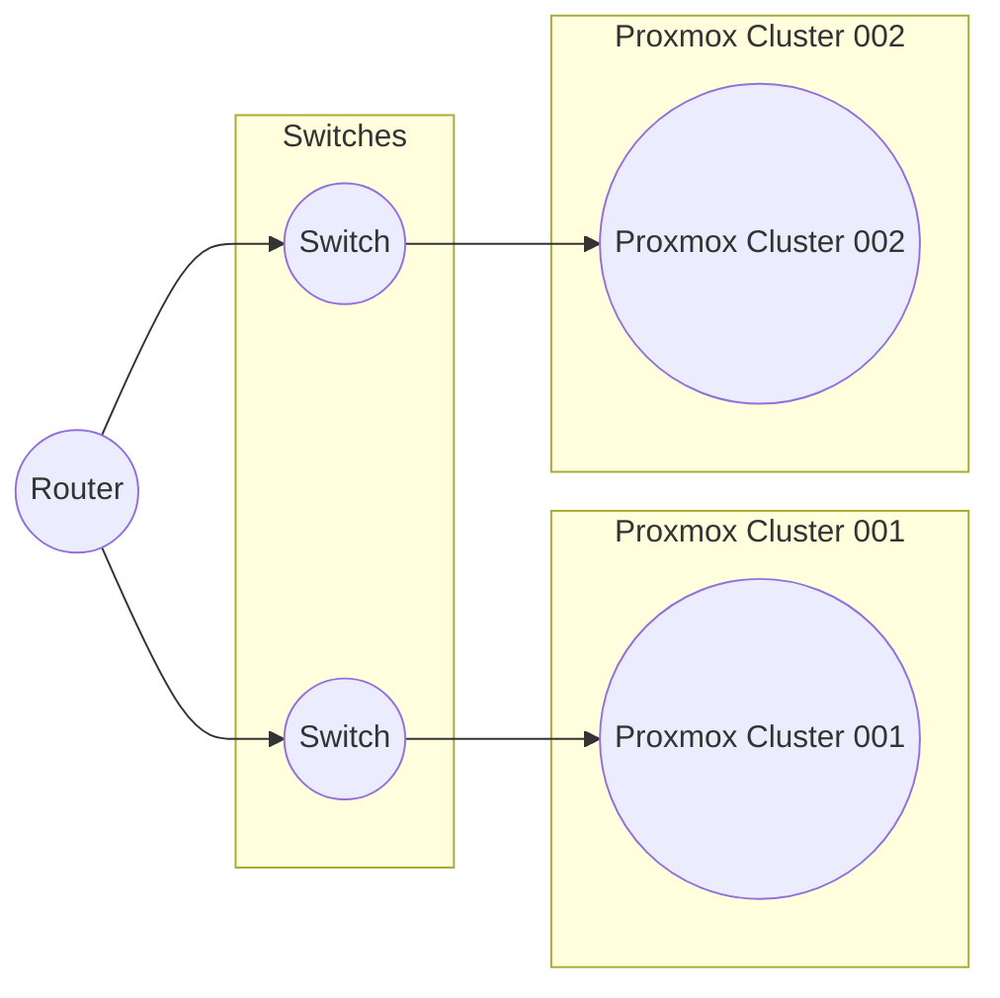

## Overview

### Network Layout

# Overview

This wiki page links into the docs-first structure for the Remote Desktop Platform on Proxmox.

- Architecture overview: see [Docs/Architecture/Platform.md](Docs/Architecture/Platform.md)
- Networking model: see [Docs/Architecture/Networking.md](Docs/Architecture/Networking.md)
- Runbooks: see [Docs/Runbooks](Docs/Runbooks)

Network Layout (Homelab):

