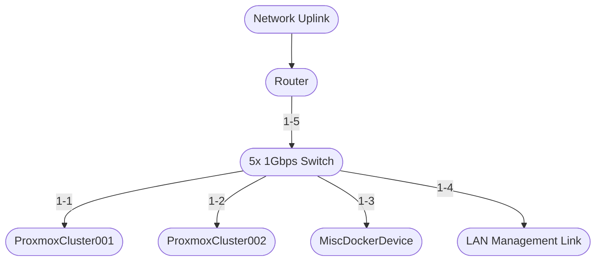

## Overview

### Network Layout

```mermaid
flowchart TD;
	Network_Uplink(["Network Uplink"]);
	Network_Uplink-->Network_Router(["Router"]);
	Network_Router--"1-5"-->Network_Switch(["5x 1Gbps Switch"]);
	Network_Switch--"1-1"-->ProxmoxCluster001(["ProxmoxCluster001"]);
	Network_Switch--"1-2"-->ProxmoxCluster002(["ProxmoxCluster002"]);
	Network_Switch--"1-3"-->MiscDockerDevice(["MiscDockerDevice"]);
	Network_Switch--"1-4"-->LAN_Management(["LAN Management Link"]);
```
